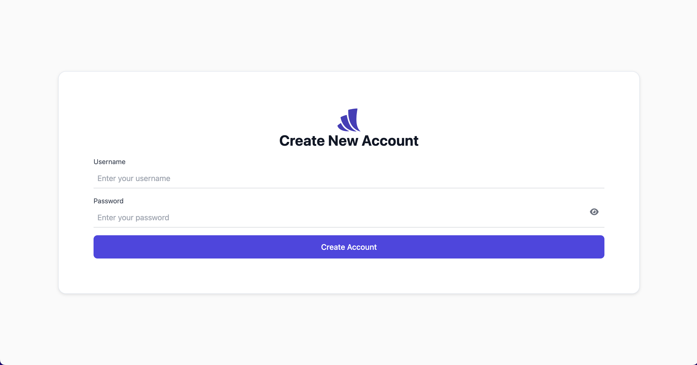

# Code Challenge Repository



## Overview

This repository contains boilerplate code you will use to build the create account form.

## Tech used

You have been given a starter repository using TypeScript / React / Vite / Tailwind / Ruby on Rails. You will only need
a basic understanding of these technologies to successfully complete this coding challenge. Refer to the documentation
links below for more information.

### Development

- [TypeScript for JavaScript Programmers](https://www.typescriptlang.org/docs/handbook/typescript-in-5-minutes.html)
- [React docs](https://reactjs.org/docs/hello-world.html)
- [Tailwind docs](https://tailwindcss.com/docs/installation)
- [Vite - Getting Started](https://vitejs.dev/guide/)
- [Ruby on Rails - Getting Started](https://guides.rubyonrails.org/getting_started.html)

### Testing

- [Jest - Getting Started](https://jestjs.io/docs/getting-started)
- [Testing Rails Applications](https://guides.rubyonrails.org/testing.html)
- [React Testing Library](https://testing-library.com/docs/react-testing-library/example-intro)

## Noteworthy improvements

### 1. Secure Password Storage

- Implemented password hashing using bcrypt to ensure user passwords are securely stored in the database.

### 2. Enhanced Form Validation

- Added client-side validation to provide immediate feedback to users for improved usability.
- Integrated the Zxcvbn library to ensure strong password requirements with real-time strength feedback.
- Introduced a debounce timeout to delay password strength evaluation, reducing unnecessary processing on every keystroke.

### 3. User-Friendly Error Messaging

- Designed clear and concise error messages to guide users through form correction.

### 4. Added Toggle Password Visibility Feature

- Implemented a visibility toggle button for password input fields, allowing users to view or hide their password as needed.
- Enhances user experience by reducing errors during password entry, especially for complex passwords.
- Ensured that the toggle functionality maintains security, defaulting to hidden mode and not compromising password safety.
- Incorporated accessible labels and icons to ensure the feature is intuitive and usable for all users, including those with assistive technologies.

### 5. Leveraged Rails' Automatic Input Validation

- Utilized Rails' built-in validations to ensure robust server-side input checking for the account creation form.
- Applied validates methods directly on the User model to enforce constraints such as username and password length, and format requirements (e.g., presence of letters and numbers).

## Versions

```
▶ node -v
v18.17.1

▶ npm -v
10.1.0
```

If NodeJS is not installed on your computer, we recommend using [nvm](https://github.com/nvm-sh/nvm) for version management.

```
▶ ruby -v
ruby 3.1.4p223 (2023-03-30 revision 957bb7cb81) [arm64-darwin22]
```

If Ruby is not installed on your computer, we recommend using [rbenv](https://github.com/rbenv/rbenv) for version management.

**Note:** `[arm64-darwin22]` may be different as it is dependent on your operating system.

## Setup Instructions

### 1. Install Required Tools

- Ensure the following are installed on your system:
  - [Node.js](https://nodejs.org/) (Recommended: v18.17.1 via [nvm](https://github.com/nvm-sh/nvm))
  - [Ruby](https://www.ruby-lang.org/en/) (Recommended: v3.1.4 via [rbenv](https://github.com/rbenv/rbenv))

### 2. Clone the Repository

Clone the repository to your local machine:

```bash
git clone <repository-url>
cd account-creation-challenge
```

### 3. Set Up Ruby Environment

1. Ensure `rbenv` is installed

```bash
brew install rbenv ruby-build
```

2. Add `rbenv` to your shell configuration
   For example, if using zsh

```bash
echo 'eval "$(rbenv init -)"' >> ~/.zshrc
source ~/.zshrc
```

3. Install Ruby 3.1.4:

```bash
rbenv install 3.1.4
rbenv local 3.1.4
```

4. Verify the Ruby version

```bash
ruby -v
```

5. Install Bundler

```bash
gem install bundler
```

### 4. Install Backend Dependencies

1. Install Rails gem

```bash
bundle install
```

2. Set up the database

```bash
rails db:setup
```

4. Verify backend setup

```bash
rails server
```

## Testing

### Frontend Tests

```bash
npm run test
```

### Backend Tests

```bash
rails test
```

or

```bash
npm run r_test
```

### Run all Tests

```bash
npm run all_tests
```
